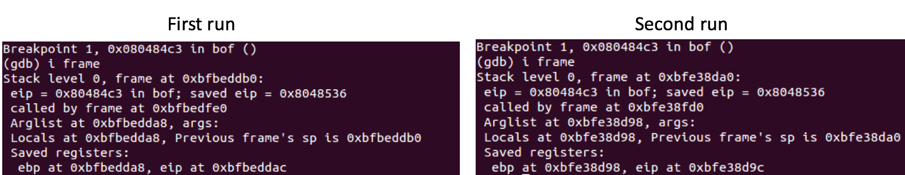
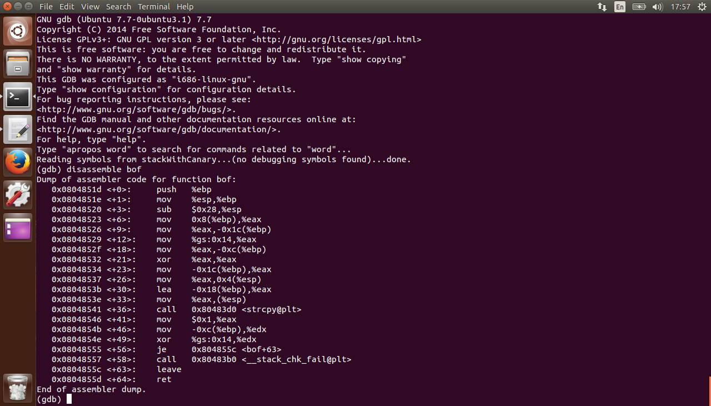
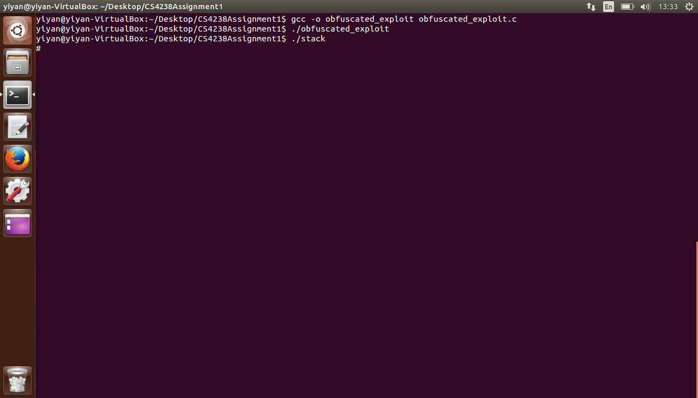

# CS4238 Assignment 1

| Name        | Matriculation No.| Email  |
| ------------- |-------------| -----|
| Tan Yi Yan      | A0127051U | yiyan@u.nus.edu |

## Task 1: Exploiting the Vulnerability
### The vulnerable program
When `bof()` is called by the `main()` function, the parameter of `bof()` (`str`), return address and previous frame pointer is pushed onto the stack. Some space on the stack is also allocated to local variables of `bof()`, as seen in Figure 1.


*Figure 1. Stack after bof() is called*

The program has a buffer overflow vulnerable because `strcpy()` does not do boundary checking before copying the `str` into `buffer`. This gives us the opportunity to overwrite the return address of `bof()` and cause the program to run our shellcode.  

### Smashed stack layout
Figure 2. shows what the stack of the vulnerable program after it was smashed with the badfile that was created using the exploit.


*Figure 2. Smashed stack layout*

After disassembling `bof()`, it was found that `buffer` is located at `ebp - 0x14`. Since the return address of `bof()` is located at `ebp + 0x4`, I know that I need to overwrite `buffer[24]` to `buffer[27]` with the address that points to somewhere in the NOP sled. As a result, the CPU thinks that the address of the NOP sled is the return address of `bof()` and execution continues to the NOP sled when `bof()` returns. Eventually, the execution will reach the shellcode that I placed at the end of the overflowed `buffer` because whenever NOP is encountered by the CPU, the CPU just does nothing and fetch the next instruction. Since I made the stack executable with `execstack`, the CPU is able to execute the shellcode that was placed on the stack by us and a shell is spawned. The shell I got is a root shell since I made the vulnerable program a `set-uid` program. The code for this task can be found in *exploit.c*.

### Obtaining the addresses required for exploit
In order to succeed in the exploit, I have to know the following addresses:
1. starting address of the buffer
2. address of the saved return address
3. target address (that is used to overwrite the original return address)

#### Starting address of the buffer
To discover the starting address, I simply added the following line into `bof()` after `buffer` is declared in the stack.c:
```
printf("%p\n", buffer);
```
The line added prints the address of `buffer`. I compiled this modified version of stack.c and ran it with an arbitrary badfile. Figure 3. shows the results of the modified stack.c program.


*Figure 3. Screenshot of the results of modified stack.c program*

As seen in Figure 3., the address of `buffer` is `0xbfffee84`.

#### Address of the saved return address
In order to obtain the address of the saved return address, I disassembled `bof()`:


*Figure 4. Disassembled code of bof*

In x86, the arguments are usually pushed onto the stack in reverse order. Since the vulnerable program called `strcpy(str, buffer)`, `buffer` is the last argument that is pushed on the stack before `strcpy()` is called. Equipped with this information, I deduced that the following instructions were probably pushing `buffer` onto the stack.
<br>

```
0x08048491 <+13>:    lea    -0x14(%ebp),%eax
0x08048494 <+16>:    mov    %eax,(%esp)

```
On inspection, it is evident that `buffer` is located at `ebp - 0x14`. Moreover, it is a known fact that the return address is usually located at `ebp + 0x4`. With these 2 pieces of information and the starting address of the buffer, the address of the saved return address can be calculated. The distance from the start of `buffer` to the address of the saved return address is `(ebp + 0x4) - (ebp - 0x14) = 0x18`. Hence, the address of the saved return address is `starting address of buffer + 0x18`. In other words, the address of the saved return address is  `&buffer + 24`.

#### Target address
After obtaining the location of the return address, I need to know what address to overwrite the return address with. As explained (in *Smashed Stack Layout*), I can overwrite the return address with any address in the NOP sled. I chose to overwrite the return address with the start of the NOP sled. This can calculated using the start address of the buffer. The NOP sled starts immediately after the address of the saved return address. Therefore, the target address is `&buffer + 24 + 4`.  

### The shell
Figure 5. shows the result of the exploit - a root shell is successfully obtained.

<br>


*Figure.5 Screenshot of root shell*

## Task 2: Address Randomization

### Address Space Layout Randomization (ASLR)

ASLR is a measure that greatly reduces the chance of success of exploits that depend on predetermined memory addresses. It works by randomizing the addresses of some components of the program every time it is run. These components include the stack, heap and libraries. As a result of this randomization, it makes it hard for attackers to identify which addresses to use in their attacks.  

### Why does ASLR prevent the exploit
ASLR prevents the exploit in task 1 by making it difficult to jump to the correct address. The address of the stack changes every time the program is run. As seen Figure 6., the starting memory of the stack frame is `0xbfbeddb0` in the first run but in the second run, it is `0xbfe38da0`. `buffer` is a local variable on the stack so its address will change too. With the ASLR turned on, the address of `buffer` will not always be `0xbfffee84` (as was found in Task 1). This prevents the exploit in Task 1 from working since the exploit relied heavily on knowing the exact location of `buffer` in the memory in order to jump to the target address. In other words, the target address that was used in Task 1 (`0xbfffee84 + 0x1c`) may not be the address of some location inside the NOP sled on different runs of the programs. Hence, the exploit in Task 1 did not succeed when ASLR is turned.



*Figure.6 info frame of the program on separate runs*

## Task 3: Stack Guard

### Stack Guard
Stack guard is a mechanism that detects stack smashing. It terminates the program when stack smashing is detected. In order to detect stack smashing, a canary value is put below the saved frame pointer whenever a function is entered. On exiting the function, this canary value is checked. If the canary value is unchanged, all is well. However, if the canary is altered, it implies that a possible stack smashing has occurred and hence, the program is terminated to prevent it from being exploited.

### Why does Stack Guard prevent the exploit
Stack Guard prevents the exploit in Task 1 because it prevents stack overwriting. As seen in the disassembled `bof()` from the program compiled with stack guard in Figure 7., there are instructions to place the canary on the stack and check the canary before exiting `bof()`. The lines `<+12>` to `<+21>` places a canary value onto the stack while the lines `<+46>` to `<+58>` checks whether the canary is unaltered and terminates the program with an error if the canary is changed. The exploit in Task 1 will overwrite the canary value as it overflows the `buffer`, fail the check of the canary value before `bof()` exits and terminate the program. The program terminates even before execution can jump to the target address hence, the exploit fails.



*Figure.7 Dissambled bof with stack guard enabled*

## Task 4: Non-executable Stack

### Non-executable Stack
Non-executable stack is a protection mechanism that prevents execution of malicious code that is placed on the stack. The entire stack is flagged as non-executable - the stack will have no `x` permission. If there is an attempt to execute the data on the stack, `SIGSEGV` is raised. Hence, any malicious code cannot be executed.

### Why does non-executable stack prevent the exploit
Non-executable stack prevents the exploit in Task 1 because it prevents the execution of the shellcode. As seen in the `/proc` of the program (which I renamed to *nonExecStack*), the program's stack have been set with permissions `rw-p`. There is no `x` permission for the stack. One of the conditions that the exploit in Task 1 depended on to succeed is the fact that the shellcode on the stack can be executed. However, this condition is removed when the stack of the program has been made non-executable. Instead of obtaining the root shell, the exploit only cause the program to crash now. This is because when execution jumps to target address as `bof()` returns, the CPU attempts to execute the instructions at the target address but the execution fails due to the lack of `x` permission. Hence, the malicious shellcode cannot be executed to obtain a root shell.


*Figure.8 /proc of program when stack is made non-executable*

## Task 5: Shellcode Obfuscation

### Shellcode with no "/bin/sh" string hardcoded

One way of obfuscating shellcode so that there is no hardcoded "/bin/sh" string is to perform some arithmetic or logical operations on the string, use the resulting string in the shellcode and add some instructions to the shellcode to reverse the arithmetic or logical operations that was performed on the string.

In order words, I replaced the following instructions, that pushes the hardcoded strings onto the stack, in the original shellcode:
```
pushl   $0x68732f2f
pushl   $0x6e69622f            
```
With the following instructions:
```
movl <"//sh" after operation 1>,%edx
perform inverse of operation 1 on %edx
pushl %edx
movl <"//sh" after operation 2>,%edx
perform inverse of operation 2 on %edx
pushl %edx
```
Firstly, the resulting string after performing some operations is moved into a register. Subsequently, the inverse of the operations are performed on the register. As a result, the register now contains the actual string that I need so I pushed the register onto the stack.

(Multiple operations could have been performed the strings and reversed in the subsequent instructions in the shellcode. For the sake of brevity, I only used one operation in the illustration.)

### Obfuscated shellcode
For my obfuscated shellcode, I chose to use the XOR operation on both of hardcoded strings. The following table show the bitmask I used and the results of the XOR:

| String        | Hex Representation | Bitmask  | Result |
| ------------- |-------------|---------|---------|
| `"\\sh"`     | `0x68732f2f` | `0xbebebebe` | `0xd6cd9191`|
| `"\bin"`     | `0x6e69622f` | `0xbebebebe` | `0xd0d7dc91`|

Using the resulting strings, I can now write the instructions which I will be using to replace the 2 `pushl` instructions that uses hardcoded strings in the original shellcode:
```
movl    $0xd6cd9191, %edx      
xorl    $0xbebebebe, %edx      
pushl   %edx					  
movl    $0xd0d7dc91, %edx	   
xorl    $0xbebebebe, %edx      
pushl   %edx					  
```

To obtain the hex representation of these instructions, I wrote a short program consisting of the above instructions by using `__asm__`. I compiled the program and retrieved the hex representation of the instructions from the `objdump` of the compiled program. The code of this program can be found in *asm.c*.

After replacing the appropriate portions of the shellcode with the instructions that I wrote, the final shellcode that I used was:
```
"\x31\xc0"             		/* xorl    %eax,%eax              */
"\x50"                 		/* pushl   %eax                   */
"\xba\x91\x91\xcd\xd6" 		/* movl    $0xd6cd9191, %edx      */
"\x81\xf2\xbe\xbe\xbe\xbe"  /* xorl    $0xbebebebe, %edx      */
"\x52"						/* pushl   %edx					  */
"\xba\x91\xdc\xd7\xd0"		/* movl    $0xd0d7dc91, %edx	  */
"\x81\xf2\xbe\xbe\xbe\xbe"  /* xorl    $0xbebebebe, %edx      */
"\x52"						/* pushl   %edx					  */
"\x89\xe3"            		/* movl    %esp,%ebx              */
"\x50"                	    /* pushl   %eax                   */
"\x53"                	    /* pushl   %ebx                   */
"\x89\xe1"                  /* movl    %esp,%ecx              */
"\x99"                      /* cdql                           */
"\xb0\x0b"                  /* movb    $0x0b,%al              */
"\xcd\x80"                  /* int     $0x80                  */
```

Using the above obfuscated shellcode that has no hardcoded `"/bin/sh"`, I was able to obtain a root shell:



*Figure.9 Screenshot of root shell obtained using obfuscated shellcode*

The code that I used for this task can be found in *obfuscated_exploit.c*.
